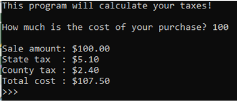

# Debugging Lab - Taxes

### Instructions:
 
- The code is written and contained in this repo, but it contains errors. Correct the given code.
  - DOCUMENT each of the corrections by placing a comment stating what was corrected on any lines changed
- The purpose of this program is to use functions to calculate the state and county taxes to be charged on a purchase: 
  - A function should be created that takes as arguments the current state tax rate and the amount of a sale. It should calculate the state tax owed on the purchase and return it. 
  - A function should be created that takes as arguments the current county tax rate and the amount of a sale. It should calculate the county tax owed on the purchase and return it. 
  - The state tax rate is currently 5.1%. 
  - The county tax rate is currently 2.4%. 
  - The program should print the purchase price, state tax, county tax and total cost 
- Modify the comments in the code to reflect your name and the date you worked on the assignment.        
- Push the program source code to the assignment repo. 

### Example Output

### Grading:
- General, compiles, comments, proper indentation, etc  
- Each Problem Found and Corrected  

